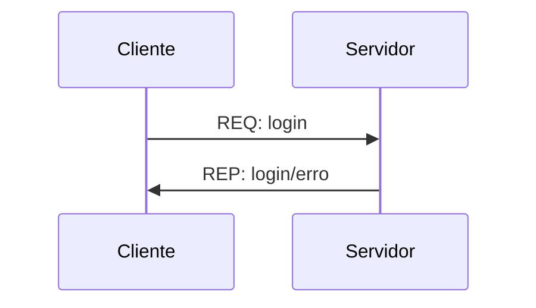
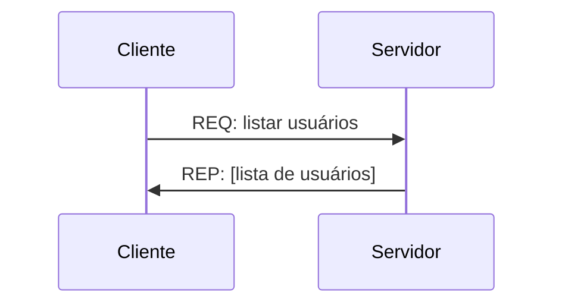
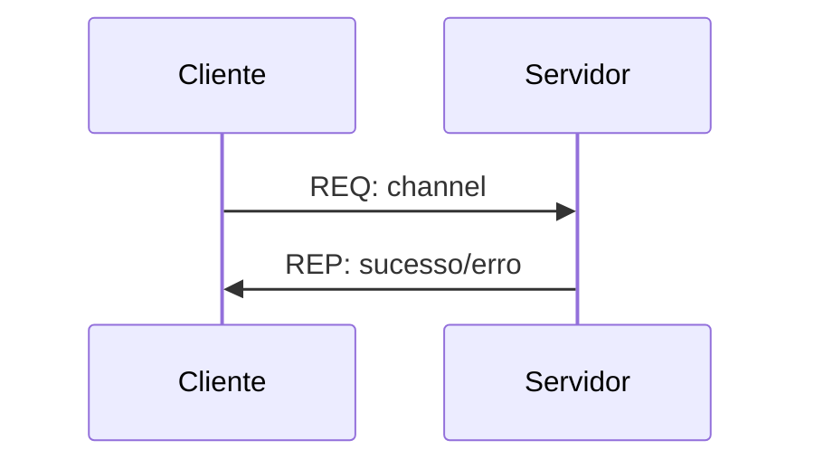
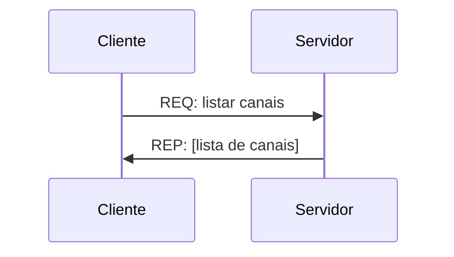

# Parte 1: Pedido de informações usando Request-Reply

A primeira parte que iremos implementar é a o pedido de informações sobre o servidor usando o padrão Request-Reply.

Para esta parte, vamos assumir que os usuários utilizam o programa do cliente para se conectarem ao servidor e realizarem a troca de mensagens e que o servidor terá condições de respoder a todas as requisições dos usuários.

## Login do usuário

O primeiro passo é realizar o login do usuário assim que o container inicializar. Como este projeto é um protótipo, não vamos ter senhas, somente o nome do usuário. Neste caso, a troca de mensagem entre o usuário e o servidor será:



A mensagem enviada pelo cliente para o servidor deve ser dividida em 2 partes sendo que a primeira é o tipo de serviço que será usado (neste caso, login) e a segunda parte deve conter o nome de usuário escolhido e o timestamp do envio da mensagem, ou seja:

```json
{
  "service": "login",
  "data": {
    "user": "nome de usuário",
    "timestamp": [gerado no envio da mensagem]
  }
}
```

A resposta do servidor para o cliente também deve conter 2 partes, sendo que a primeira é o tipo de serviço que foi usado e a segunda contém as informações sobre o sucesso ou erro no cadastro, o timestamp e, caso a mensagem seja de erro, deve retornar uma descrição do erro. Desta forma, a mensagem tem o formato:
```json
{
  "service": "login",
  "data":{
    "status": "sucesso"/"erro",
    "timestamp": [gerado no envio da mensagem],
    "description": [caso a mensagem seja de erro]
  }
}
```

## Listagem de usuários cadastrados

Uma vez que todos os usuários deverão se cadastra no serviço, também será possível pedir que o servidor retorne uma lista de todos os usuários disponíveis.

A sequência para a troca de mensagens e os formatos das mensagens estão a seguir.



```json
{
  "service": "users",
  "data": {
    "timestamp": [gerado no envio da mensagem]
  }
}
```

```json
{
  "service": "users",
  "data": {
    "timestamp": [gerado no envio da mensagem]
    "users": [lista de usuários]
  }
}
```
Utilizando estes dois formatos de mensagens o cliente consegue logar no sistema e descobrir quem são os outros usuários que estão cadastrados no servidor e que poderão tanto mandar mensagens como postar no canais.

## Criação e listagem de canais para troca de mensagens

Da mesma forma que fizemos com os usuários, vamos implementar uma forma do usuário descobrir quais canais para troca de mensagens estão disponíveis e também de criar um canal novo caso este não exista.

Para criação de canal vamos usar o padrão de troca de mensagem como:



E as trocas de mensagens entre cliente e servidor como:

```json
{
  "service": "channel",
  "data": {
    "channel": "nome de canal",
    "timestamp": [gerado no envio da mensagem]
  },
}
```

```json
{
  "service": "channel",
  "data":{
    "status": "sucesso"/"erro",
    "timestamp": [gerado no envio da mensagem],
    "description": [caso a mensagem seja de erro]
  }
}
```

Para o da listagem de canais, o padrão fica como a listagem de usuários:


com as mensagens:

```json
{
  "service": "channels",
  "data": {
    "timestamp": [gerado no envio da mensagem]
  }
}
```

```json
{
  "service": "channels",
  "data": {
    "timestamp": [gerado no envio da mensagem]
    "users": [lista de canais]
  }
}
```

Com estas 4 troca de mensagens implementadas o usuário consegue logar e descobrir como poderá interagir com os outros usuários. A interação entre eles será desenvolvida nas próximas aulas.

## Persistência dos dados

Para não perder informações entre as sessões, o servidor deve armazenar os dados em disco e, como informado no enunciado do projeto, a forma como o dado será armazenado é livre. Porém, os dados que devem ser armazenados serão padronizados, ou seja:
- o servidor deve armazenar todos os logins realizados pelos usuários junto com o timestamp do login
- todos os canais criados pelos usuários devem ser armazenados para serem usados por todos os outros usuários
- nas próximas partes do projeto vamos adicionar a persistência das mensagens postadas e enviadas
