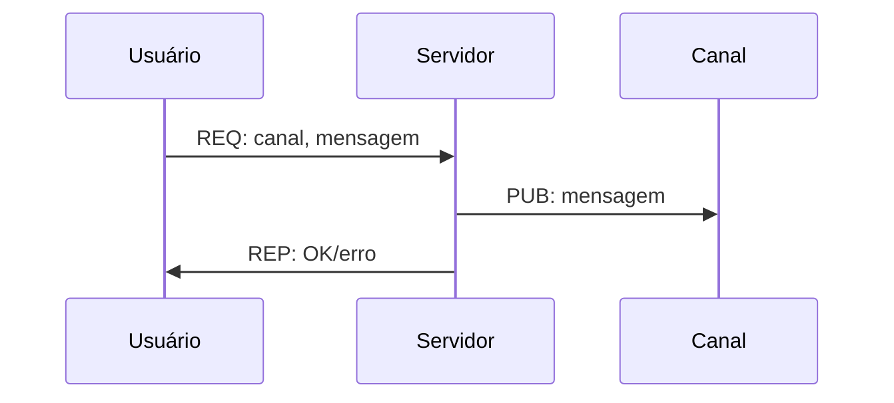
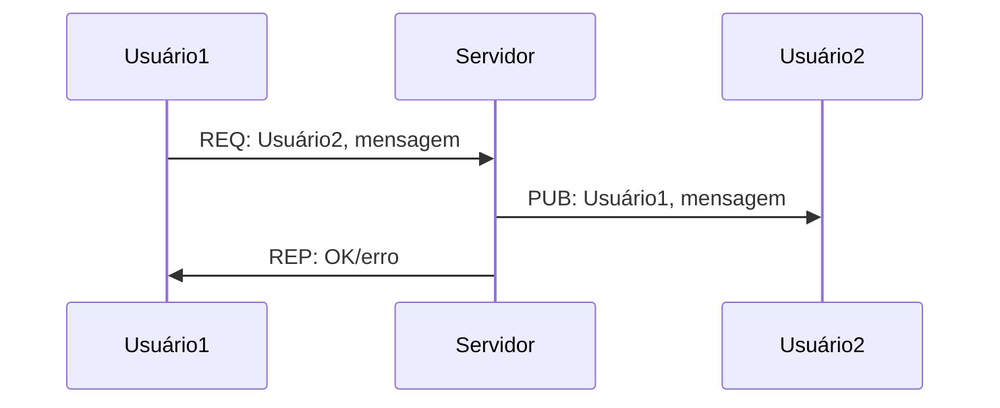

# Troca de mensagens usando Publisher-Subscriber

Uma vez que o usuário consegue pedir informações ao servidor, é possível permitir que ele envie mensagens à outros usuários e também que publique mensagens em canais. Para isso, o usuário fará uma requisição ao servidor e o servidor publicará a mensagem no tópico correto de forma que a publicação no canal tem como tópico o nome do canal e a mensagem para o usuário tem como tópico o nome do usuário que receberá a mensagem.

## Funcionalidades que devem ser implementadas, mas que não precisam de troca de Mensagens

Para que as publicações e mensagens funcionem, é necessário que os usuários possam se inscrever nos tópicos do Pub/Sub. Para isso, um usuário cadastrado deve se inscrever para receber mensagens no tópico que tem o seu próprio nome e também ter a opção de se inscrever em canais que foram criados no servidor.

Para facilitar um pouco o desenvolvimento do projeto, o proxy para o Pub/Sub será separado do broker do Req-Rep. Adicione este novo container ao `docker-compose.yml` usando a porta 5557 como `XSUB` e 5558 como `XPUB`.

A partir desta parte do projeto, o servidor também deve persistir em disco as publicações e mensagens trocadas pelos usuários. O formato do armazenamento é livre, porém deve ser armazenado de forma que seja possível recuperar todas as informações caso seja necessário no futuro.

## Publicações em canais

Para a publicação em um canal, o usuário fará uma requisição ao servidor enviando o canal, a mensagem e o timestamp no serviço de nome `publish`. O servidor fará a publicação no canal escolhido e em seguida retornará ao usuário se a publicação deu certo ou erro caso o canal não exista. O diagrama a seguir mostra a troca de mensagens entre o usuário (i.e., cliente) e o servidor.



A mensagem enviada pelo cliente ao servidor segue o formato:
```json
{
  "service": "publish",
  "data": {
    "user": [nome do usuário]
    "channel": [nome do canal],
    "message": [mensagem a ser publicada]
    "timestamp": [gerado no envio da mensagem]
  }
}
```
e a publicação feita no canal deve exibir o nome do usuário e a  mensagem. A resposta(reply) do servidor ao cliente deve seguir o formato:
```json
{
  "service": "publish",
  "data": {
    "status": "OK"|"erro",
    "message": [mensagem de erro caso o canal não exista]
    "timestamp": [gerado no envio da mensagem]
  }
}
```

Desta forma, o usuário enviará a mensagem ao servidor e saberá se teve algum problema com a publicação da mensagem.

## Mensagens para usuários

A troca de mensagens entre usuários segue um padrão parecido, porém no lugar do canal da publicação deverá ser enviado o nome do usuário que receberá a mensagem, conforme o diagrama a seguir:


A mensagem enviada pelo cliente ao servidor tem o formato:
```json
{
  "service": "message",
  "data": {
    "src": [nome do usuário de origem]
    "dst": [nome do usuário de destino]
    "message": [mensagem a ser enviada]
    "timestamp": [gerado no envio da mensagem]
  }
}
```
e a publicação deve ser feita no tópico que possui o nome do usuário de destino para que ele receba a mensagem. A resposta(reply) do servidor ao cliente deve seguir o formato:
```json
{
  "service": "message",
  "data": {
    "status": "OK"|"erro",
    "message": [mensagem de erro caso o usuário não exista]
    "timestamp": [gerado no envio da mensagem]
  }
}
```

## Cliente para gerar mensagens automaticamente

Para facilitar os testes que faremos nesta parte e nas próximas, implemente um cliente que não depende de interações com o usuário. Este cliente deve escolher um nome de usuário aleatório para se conectar ao servidor e em seguida ficar para sempre em um loop executando:
1. escolher um canal aleatório entre os que estão disponíveis
2. enviar 10 mensagens definidas por você (mas podem ser aleatórias)
3. voltar ao primeiro passo

Este cliente deverá ser adicionado ao `docker-compose.yml` com pelo menos 2 réplicas para que fique mais fácil de verificar o funcionamento do cliente.
