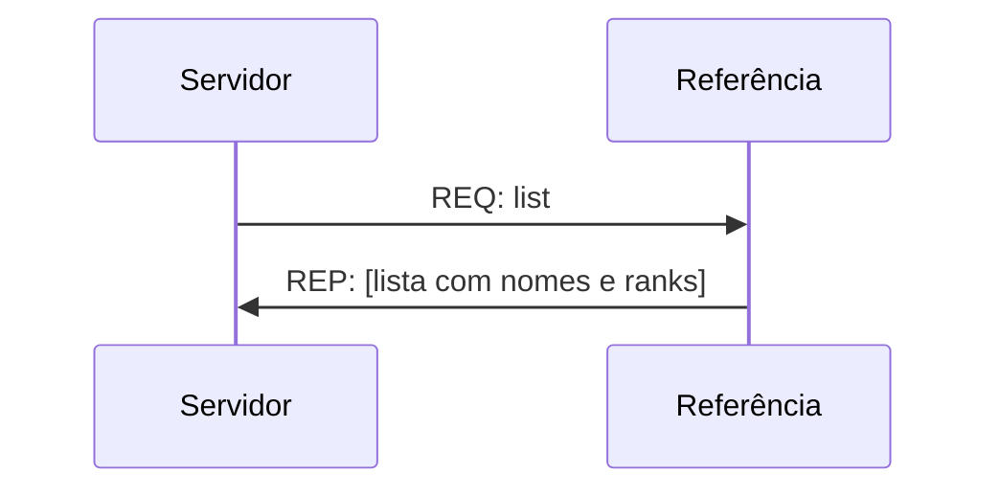
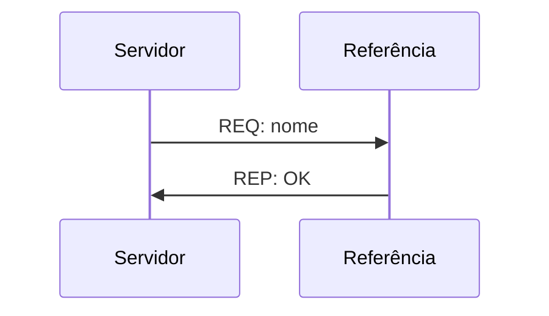
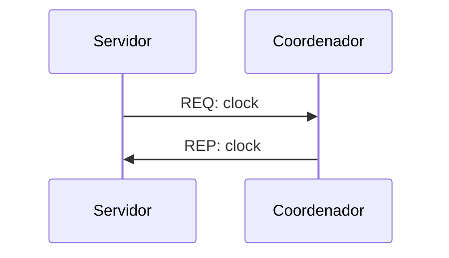
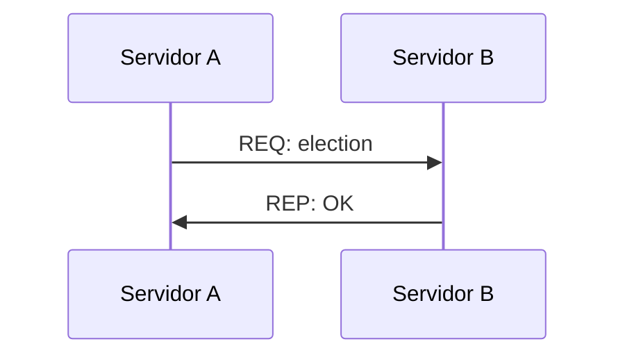
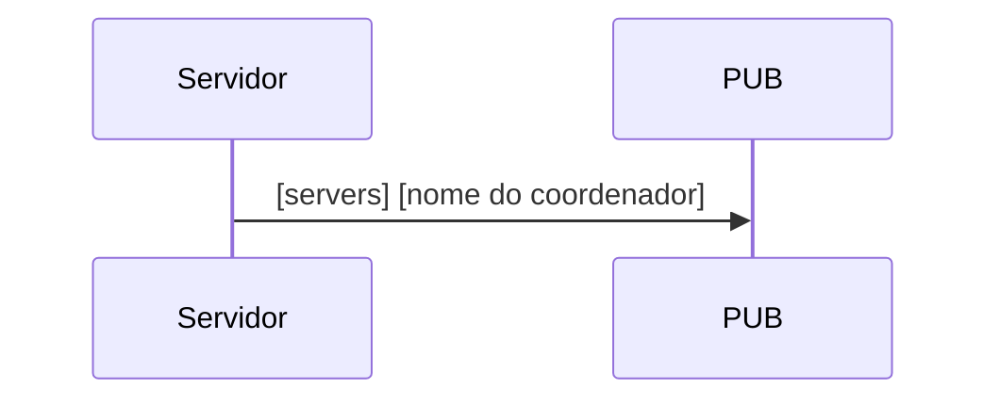
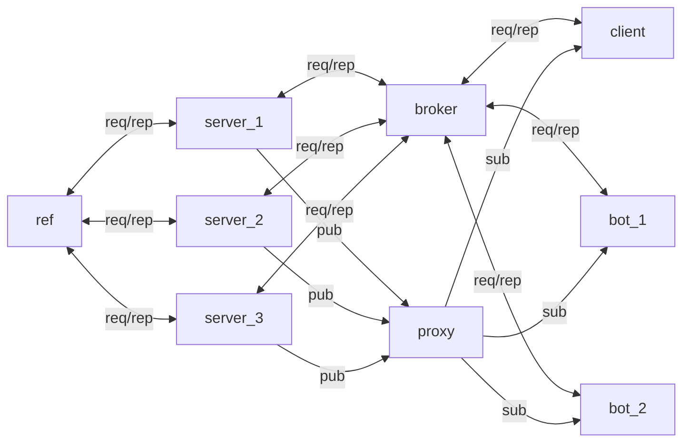

# Relógios

Uma vez que servidores, cliente e bots estão funcionando, podemos adicionar os relógios para sincronizar todos os processos. Neste projeto vamos adicionar o relógio lógico em todos os processos para organizar as ordens das mensagens e a sincronização do relógio físico nos servidores.

## Relógio lógico

O relógio lógico deverá ser implementado tanto no cliente (cliente e bot) como no servidor. Para isto será usado um contador que iniciará junto com o processo e deve seguir a proposta, conforme apresentada em aula:
1. o contador deve ser incrementado antes do envio de cada mensagem e deve ser enviado junto com a mensagem
2. quando uma mensagem for recebida, o processo deve comparar o seu contador com o que foi recebido na mensagem e usar como novo valor de seu contador o máximo entre o valor recebido na mensagem e o valor que possuia

Portanto, todas as mensagens que foram trocadas devem possuir além do timestamp, o valor do contador de quem envia a mensagem.

## Sincronização do relógio dos servidores

Para a sincronização dos servidores, vamos criar um novo processo (que deve ser adicionado ao `docker-compose.yml`) que servirá como referência para informações como endereços dos servidores e rank do servidor.

Este novo processo fará apenas a comunicação com os servidores e não receberá mensagens dos clientes. Ele será responsável por:
1. informar o rank do servidor: o servidor deve fazer uma requisição para saber o seu rank e receberá este valor no reply, conforme o padrão a seguir:


```json
{
  "service": "rank",
  "data": {
    "user": [nome do servidor],
    "timestamp": [gerado no envio da mensagem],
    "clock": [valor do relógio lógico]
  }
}
```

```json
{
  "service": "rank",
  "data": {
    "rank": [rank do servidor],
    "timestamp": [gerado no envio da mensagem],
    "clock": [valor do relógio lógico]
  }
}
```

2. armazenar a lista de servidores cadastrados: quando um servidor inicia e faz o pedido de rank, ele deve armazenar o nome e rank do servidor, sem repetições de nome;

3. fornecer a lista de servidores: deve possuir um serviço que retorna o nome e rank de todos os servidores que estão disponíveis, conforme o padrão a seguir:



```json
{
  "service": "list",
  "data": {
    "timestamp": [gerado no envio da mensagem],
    "clock": [valor do relógio lógico]
  }
}
```

```json
{
  "service": "list",
  "data": {
    "list": [lista com nomes e ranks de cada servidor],
    "timestamp": [gerado no envio da mensagem],
    "clock": [valor do relógio lógico]
  }
}
```

4. atualizar a lista de servidores conforme a disponibilidade (heartbeat): cada servidor deve enviar periodicamente uma mensagem a este processo avisando que ainda está funcionando para ser mantido na lista de servidores.



```json
{
  "service": "heartbeat",
  "data": {
    "user": [nome do servidor],
    "timestamp": [gerado no envio da mensagem],
    "clock": [valor do relógio lógico]
  }
}
```

```json
{
  "service": "heartbeat",
  "data": {
    "timestamp": [gerado no envio da mensagem],
    "clock": [valor do relógio lógico]
  }
}
```

Para a sincronização do relógio vamos usar o algoritmo de Berkeley e os servidores devem manter uma variável com o nome do servidor que foi eleito como coordenador, além de atualizarem os seus relógios a cada 10 mensagens trocadas. Os servidores também conseguir realizar a troca de mensagem para a sincronização do relógio segundo:



```json
{
  "service": "clock",
  "data": {
    "timestamp": [gerado no envio da mensagem],
    "clock": [valor do relógio lógico]
  }
}
```

```json
{
  "service": "clock",
  "data": {
    "time": [horário lido],
    "timestamp": [gerado no envio da mensagem],
    "clock": [valor do relógio lógico]
  }
}
```

E caso o coordenador não esteja disponível, um servidor deve ser capaz de enviar uma requisição aos outros servidores pedindo eleição:



```json
{
  "service": "election",
  "data": {
    "timestamp": [gerado no envio da mensagem],
    "clock": [valor do relógio lógico]
  }
}
```

```json
{
  "service": "election",
  "data": {
    "election": "OK",
    "timestamp": [gerado no envio da mensagem],
    "clock": [valor do relógio lógico]
  }
}
```

e também devem conseguir avisar a todos os outros servidores por meio de uma publicação no tópico `servers` que quando é eleito como servidor:


```json
{
  "service": "election",
  "data": {
    "coordinator": [nome do novo coordenador]
    "timestamp": [gerado no envio da mensagem],
    "clock": [valor do relógio lógico]
  }
}
```

Com estas mudanças podemos testar se os servidores estão sincronizando o relógio com o coordenador e também se os relógios lógicos estão atualizados. Estas função serão úteis na próxima (e última) parte do projeto.

## Versão final do sistema

O diagrama a seguir mostra a conexão entre os containers criados usando 3 servidores, 2 bots, 1 cliente, 1 proxy, 1 broker e 1 servidor de referência. Os containers que possuem mais do que um devem ser configurados no `docker-compose.yml` como `replica`s dos containers, pois devem usar o mesmo código.


